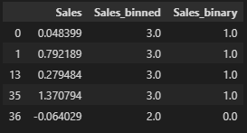
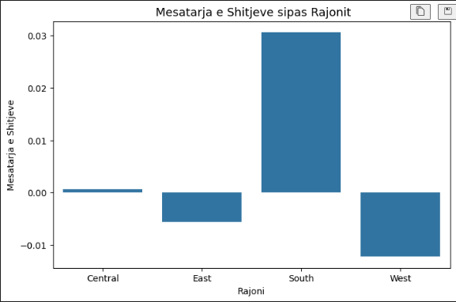
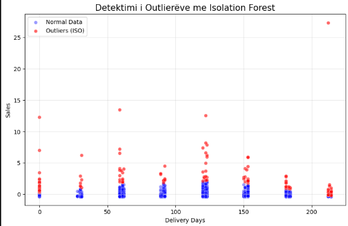

# Data Processing and Visualization: Superstore Sales Overview

**Universiteti i Prishtinës**  
**Fakulteti i Inxhinierisë Elektrike dhe Kompjuterike**  
Programi i Masterit në **Inxhinieri Elektrike dhe Kompjuterike**  
Lënda: **Përgatitja dhe vizualizimi i të dhënave**

## Profesori
- **Mërgim Hoti**
## Student-ja
- **Anjeza Sfishta**

# Data Processing and Visualization: Superstore Sales Overview  

Ky repository përdoret për qëllime studimore në fushën e **Përgatitjes dhe Vizualizimit të të Dhënave**, duke analizuar të dhënat e shitjeve të dataset-it **Superstore**.  
Projekti ka për qëllim përgatitjen, pastrimin, transformimin dhe vizualizimin e të dhënave për të nxjerrë njohuri mbi shitjet, rajonet, produktet dhe segmentet e klientëve.

## Përshkrimi i Dataset-it

Dataset-i **Superstore Sales** është marrë nga një burim publik (Kaggle) dhe përmban të dhëna të shitjeve të simuluara për tregun e **Shteteve të Bashkuara të Amerikës**.  
Edhe pse nuk është 100% real, ai është një **dataset demonstrues** i ndërtuar për analiza të biznesit dhe trajnime në fushën e data science.

- Madhësia: **rreth 2.3 MB**  
- Numri i kolonave: **18**  
- Përmbajtja përfshin:
  - Informacione për **shtete, qytete, rajone dhe kode postare**  
  - Të dhëna për **produktet, kategoritë, klientët dhe segmentet**  

## Rezultatet e Pjesës I – Para-Procesimi

Në këtë pjesë u kryen hapat kryesorë të përgatitjes së të dhënave për analizë:  

1. **Ngarkimi dhe inspektimi i dataset-it** – shikimi i rreshtave të parë, tipeve të kolonave dhe vlerave të munguar.  
2. **Pastrimi i të dhënave** – heqja e duplikateve, trajtimi i vlerave të zbrazëta dhe konvertimi i kolonave të datës në format të saktë.  
3. **Diskretizimi, binarizimi dhe standardizimi** – kolonat numerike u normalizuan për analiza të mëtejshme.  
4. **Agregimi dhe mostrimi** – u krijuan statistika përmbledhëse, mesatare dhe total sipas rajoneve, kategorive dhe segmenteve të klientëve.  
5. **Reduktimi i dimensioneve me PCA** – u përdor PCA për të vizualizuar shpërndarjen e të dhënave dhe për të identifikuar trende kryesore.  
6. **Krijimi i veçorive të reja** – u shtua kolona `Delivery_Days` për të matur kohën e dërgesës.

### Shembuj Vizualizimesh nga Pjesa I

  
*Shpërndarja e kolonës `Sales` pas standardizimit*

  
*Mesatarja e shitjeve sipas rajoneve*

## Pjesa II – Detektimi i Outlier-ëve dhe Analiza e Avancuar

Pjesa II fokusohet në **detektimin, vizualizimin dhe mënjanimin e outlier-ëve** duke përdorur metoda të ndryshme, dhe eksplorimin multivariante të dataset-it të pastruar.

### 1. Detektimi i Outlier-ëve

Metodat e përdorura:

- **IQR (Interquartile Range)** – identifikon vlerat që janë shumë larg kufijve 25%-75%.  
- **Z-score** – vlerat që janë më shumë se 3 standard deviations larg mesatares.  
- **Grubbs Test** – zbulon outlier-in më ekstrem për kolonën `Sales`.  
- **Isolation Forest** – metodë e avancuar për të identifikuar outlier-ët në mënyrë automatike.

### Vizualizimi i detektimit te Outlier-ëve me Isolation Forest

  
*Detektimi i Outliereve me Isolation Forest*

